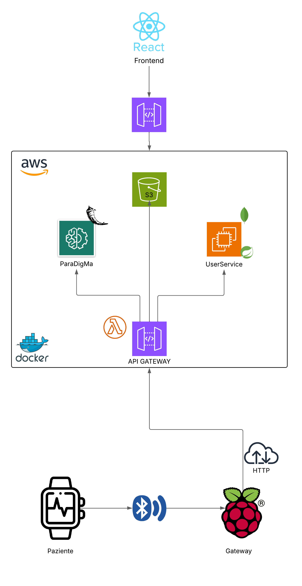

# Tremor Monitoring: Parkinson's Disease

## Panoramica

Questo progetto nasce per fornire un supporto al personale sanitario per il monitoraggio a distanza delle condizioni di un paziente domiciliarizzato
affetto dal disturbo di Parkinson.

Durante la realizzazione, i punti chiave che hanno poi influenzato la scelta dell'architettura sono stati:
- L'attenzione al paziente: rendere l'applicazione il meno invasiva ed il meno onerosa possibile a livello di interazione umana.
- Creare una struttura facilmente scalabile, sia orizzontalmente che verticalmente, favorendo il disaccoppiamennto più completo tra le varie componenti
- Fornire una struttura sicura, in quanto a che vedere con dati sensibili
- Garantire ad un medico che si interfaccia con l'applicazione di poter modificare le funzioni in base a varie esigenze diagnostiche.

Per poter sviluppare un' architettura del genere, i dati vengono prelevati tramite sensori **IMU** (Inertial MeasurementSensors) e attraverso il **BLE** (Bluetooth Low Energy), trasmessi ad un *raspberry Pi 5*, il quale si occupa della conversione e preparazione dei dati per l'algoritmo di Machine Learning. Questi dati sono poi passati ad una piattaforma cloud (**AWS**), dove risiedono oltre all'algoritmo di intelligenza artificiale, anche i microservizi per la gestione utenti e l'interfaccia frontend

Per la persistenza dei dati forniti dai sensori, e i risultati dell'inferenza, si è scelto di sfruttare il servizio cloud **S3** (Simple storage service), per disaccoppiare l'accesso dei dati, dall'inferenza in sé.

## Architettura generale

L'architettura si basa sull'utilizzo di microservizi, indipendenti, modulari e scalabili. Questi risiedono sull'infrastruttura cloud e l'accesso è fornito dai routing di **API GATEWAY**, il quale sfrutta anche il paradigma serverless (**Lambda functions**) per determinate operazioni.
Il tutto è stato poi containerizzato tramite Docker.

  

### Backend
- **UserService**: responsabile per la  gestione utenti. Fornisce operazioni CRUD sulle due entità principali della soluzione, cioè *Doctor* e *Patient*. Inoltre gestisce  registrazione, autenticazione e autorizzazione per gli utenti per cui è predisposto il servizio (*Doctor*).
- **SmartWatchService**: servizio installato localmente sul dispositivo, il quale tramite BLE si occupa di comunicare col raspberry Pi, responsabile dell'invio dei dati sul cloud
- **BLEserver**: servizio installato localmente sul raspberry, si occupa di fornire un server per la ricezione dei dati sensoriali, la conversione in un formato dati valido e l'invio di questi sul database remoto (*S3*)
- **TremorAnalysis**: Si occupa dell'esecuzione dell'algoritmo di intelligenza artificiale, basato sulla libreria di ParaDigMa. Fornisce dei rest controller per poter avviare l'inferenza su richiesta, e si interfaccia col gateway per gestire autonomamente il recupero/invio dei dati sul database remoto

### Frontend

L'interfaccia web, esposta da un microservizio sul cloud, e sviluppata con React + Vite, permette l'accesso ai medici autorizzati nel sistema. Questi possono visualizzare le informazioni sui pazienti e gestirli nel database, nonchè visualizzare in una pagina dedicata, le statistiche sul tremore rilevato nel tempo per un determinato paziente.

## Repositories dei componenti
- UserService: [UserService](https://github.com/UniSalento-IDALab-IoTCourse-2024-2025/wot-project-UserService-PiccinnoFesta)
- TremorAnalisys: [Tremor Analisys](https://github.com/UniSalento-IDALab-IoTCourse-2024-2025/wot-project-TremorAnalysis-PiccinnoFesta)
- SmartWatchService: [Smartwatch](https://github.com/UniSalento-IDALab-IoTCourse-2024-2025/wot-project-smartwatch-PiccinnoFesta)
- BLE server: [BLE Server](https://github.com/UniSalento-IDALab-IoTCourse-2024-2025/wot-project-BLEserver-PiccinnoFesta)
- Frontend: [Frontend](https://github.com/UniSalento-IDALab-IoTCourse-2024-2025/wot-project-Frontend-PiccinnoFesta)
- Presentation: [Presentation](https://github.com/UniSalento-IDALab-IoTCourse-2024-2025/wot-project-presentation-PiccinnoFesta)

## Tremor Analisys

Questo microservizio prevede due componenti:
 -`api_controller.py`: per l'esposizione di un endpoint per chiamate REST, implementato tramite *Flask* e raggiungibile grazie all'instradamento di API GATEWAY
 esegue una pipeline completa per l'**analisi automatica del tremore** a partire da dati raccolti via smartwatch (in formato TSDF). L’intero processo è automatizzato: scarica i dati da un server remoto, li elabora, estrae le feature, classifica la presenza di tremore e infine carica i risultati nuovamente sul server.
 -`tremor_analisys.py`: centro nevralgico dell servizio. Recupera i dati tramite S3, e sfrutta il toolbox di ParaDigMa per analizzare i dati, estrarre feature, e compiere una classificazione tramite un regressore logistico pre-addestrato.
 

### Funzionamento

1. **Richiede i dati di input** per un certo `patient_id` a API Gateway, il quale fornisce un *presigned url* (url autorizzato) per l'interazione con il database S3.
2. **Scarica e decomprime** i dati `.zip` che contengono segmenti in formato TSDF.
3. **Carica e allinea** i dati temporali dei batch.
4. **Esegue il preprocessing** sui segnali (es. filtraggio, interpolazione).
5. **Estrae feature di tremore** con finestre mobili.
6. **Classifica** la presenza di tremore (e se il braccio è a riposo) usando un modello pre-addestrato.
7. **Salva i risultati** in formato binario (TSDF) con relativi metadati.
8. **Comprime e carica** i risultati sul database remoto richiedendo (sempre tramite API GATEWAY), un presigned url per il caricamento su S3.
9. **Visualizza** i risultati dell’analisi in tre grafici

### Grafici

I grafici forniti, rappresentano l'elaborazione dei dati, e si dividono in:
- **Tremor power**: intensità del tremore effettivamente rilevato e classificato come tale
- **Tremor probability**: probabilità che un dato tremore sia effettivo oppure dovuto a movimenti volontari
- **Arm at Rest**: classificazione del movimento del paziente per indicare quando il braccio è a riposo e quando no. Un forte tremore in corrispondenza di braccio a riposo ha più probabilità di essere identificato come movimento involontario, e dunque tremore effettivo.

Di seguito sono presentati alcuni dei valori forniti graficamente dall'applicazione:

  

  

  

